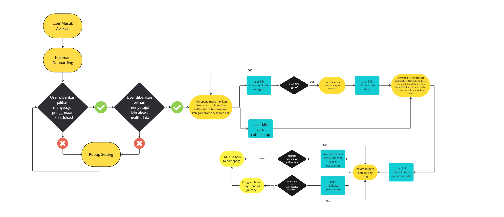
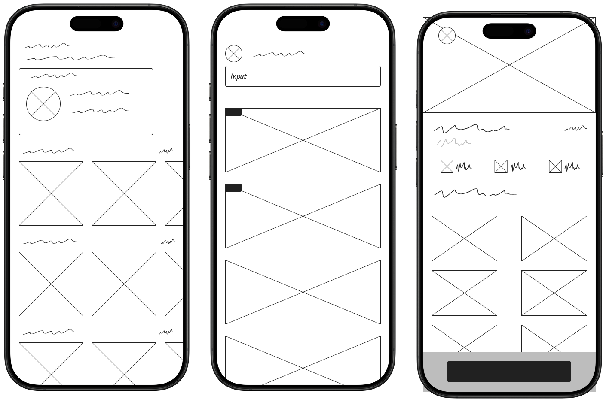
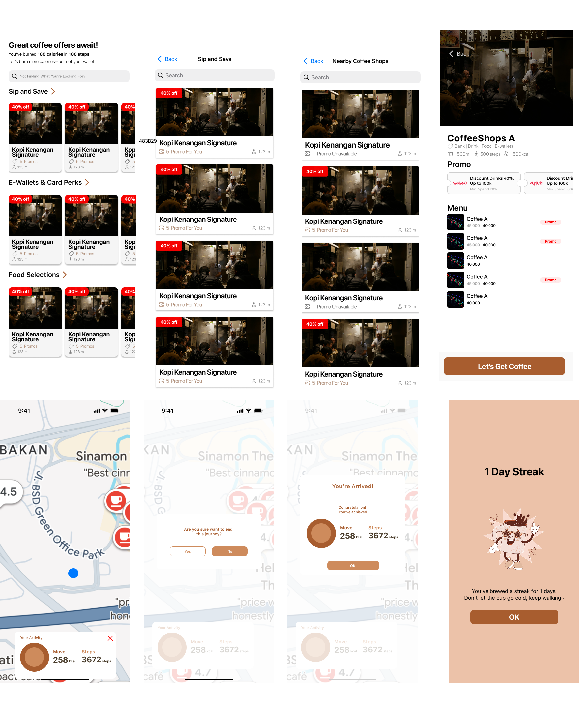

# Coffice App

## Project Description

Coffice is an iOS application designed to help office workers (and everyone else!) easily find coffee promos and other attractive deals, enabling them to save more money. This application utilizes SwiftData for efficient data management and aims to enhance the user's experience in finding promotions.

## User Story

> As an office worker, I want to find a promo before I buy coffee, so that I save more money.

## Solution Statement

> Improving the user's experience in finding promos on their iPhone using SwiftData.

## Key Features (Current & Planned)

* **Coffee Shop Search**: Find nearby coffee shops or based on specific criteria.
* **Promo Display**: Show a list of available promos from various coffee shops, categorized by:
    * E-Wallets & Card Perks
    * Food Promotions
    * Offers with the Highest Discounts ("Sip and Save")
* **Coffee Shop Details**: Display comprehensive information about a coffee shop, including:
    * Images and logo.
    * Active promo category tags.
    * Distance, estimated steps, and calories from the user's location (using Core Location).
    * Menu list with discount information.
    * List of available vouchers.
* **HealthKit Integration**: Display user's step count and calorie data on the main page to provide daily activity context.
* **MapKit Navigation**:
    * Display routes from the user's location to the destination coffee shop.
    * Dynamic user location marker with heading direction.
    * Notification when the user is near or has arrived at the destination.
* **Local Data Storage**: Utilize SwiftData to efficiently store and manage coffee shop, promo, and menu data.

## Technologies Used

* **Language**: Swift
* **UI Framework**: SwiftUI
* **Data Management**: SwiftData
* **Location Services**: Core Location
* **Health Data**: HealthKit
* **Maps & Routing**: MapKit
* **Architecture (current)**: MVVM (Model-View-ViewModel)

## Design & User Flow

Below is an overview of the application's user flow and design:

### 1. Application User Flow


<br/>
<br/>

### 2. Lo-Fi (Low Fidelity) Design


<br/>
<br/>

### 3. Hi-Fi (High Fidelity) Design


<br/>
<br/>

## Project Structure (Example)

This project is organized using the MVVM architectural pattern with the following folder structure (can be adapted):
```bash
├── ExperienceChallenge
│   ├── ExplorationChallenge.entitlements
│   ├── ExplorationChallengeApp.swift
│   ├── Info.plist
│   ├── Model
│   │   ├── CoffeeShops.swift
│   │   └── MapAnnotationItem.swift
│   ├── Resources
│   │   ├── Assets.xcassets
│   │   └── coffee_shop.json
│   ├── Services
│   │   ├── DataSeeder.swift
│   │   ├── HealthkitManager.swift
│   │   └── LocationManager.swift
│   ├── View
│   │   ├── CoffeeShopDetailView.swift
│   │   ├── CoffeeShopListView.swift
│   │   ├── Components
│   │   │   ├── PromoCardView.swift
│   │   │   ├── PromoTicketShape.swift
│   │   │   └── UserLocationAnnotation.swift
│   │   ├── Homepage.swift
│   │   └── RouteMapView.swift
│   └── ViewModel
│       ├── HomepageViewModel.swift
│       └── RouteMapViewModel.swift
├── ExperienceChallenge.xcodeproj
├── README.md
```
## How to Run the Project

1.  Clone this repository.
2.  Open the `.xcodeproj` or `.xcworkspace` file with Xcode.
3.  Ensure you have the latest version of Xcode that supports SwiftData (typically Xcode 15+).
4.  Add the "HealthKit" capability to your app target in Xcode (Signing & Capabilities).
5.  Add the necessary usage descriptions in your `Info.plist` for:
    * `NSLocationWhenInUseUsageDescription` (for Core Location)
    * `NSHealthShareUsageDescription` (for HealthKit)
6.  Build and run on a simulator or a physical device (a physical device is recommended for full HealthKit and Core Location functionality).
7.  When first launched, grant the requested permissions for location access and health data.
